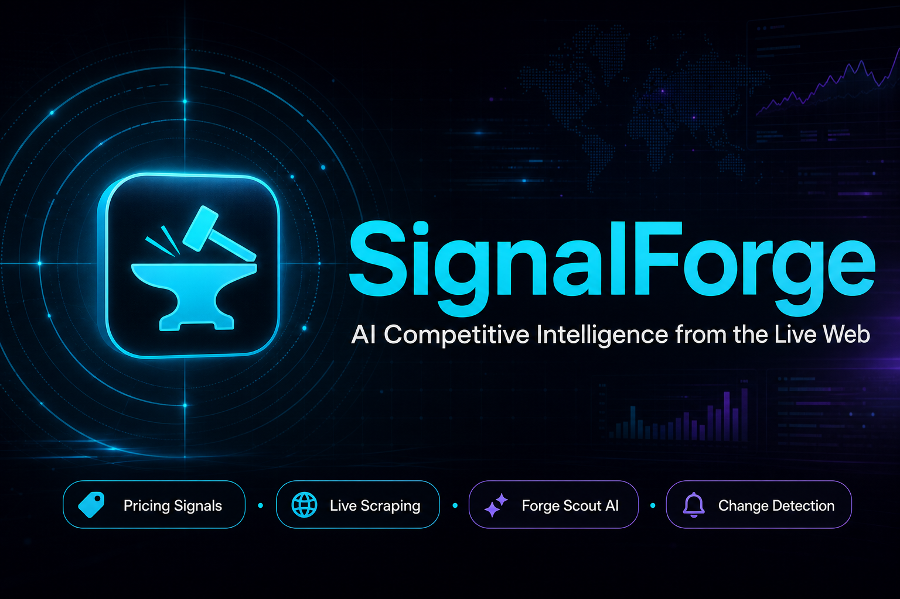
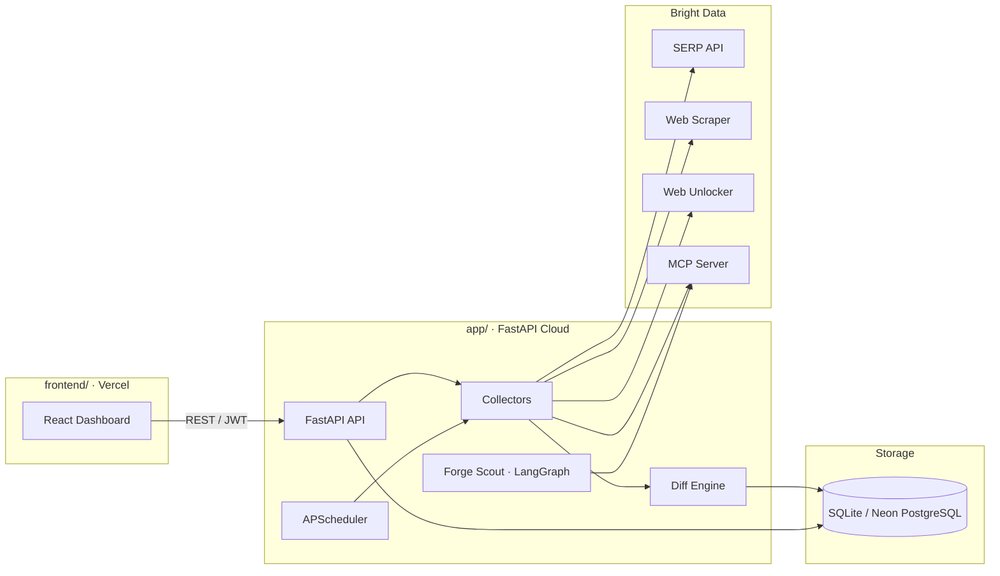

<div align="center">



# SignalForge

**Live competitive intelligence, forged from the web.**

[](https://lablab.ai/ai-hackathons/brightdata-ai-agents-web-data-hackathon)
[](https://brightdata.com/)
[](https://www.python.org/)
[](https://fastapi.tiangolo.com/)
[](https://react.dev/)
[](https://www.typescriptlang.org/)
[](https://www.langchain.com/langgraph)

[Features](#-features) · [Architecture](#-architecture) · [Tech stack](#-tech-stack) · [Quick start](#-quick-start) · [Deployment](#-deployment) · [Demo accounts](#-demo-accounts)

</div>

---

## About

**SignalForge** is a full-stack competitive intelligence platform built for the **[Web Data UNLOCKED Hackathon](https://lablab.ai/ai-hackathons/brightdata-ai-agents-web-data-hackathon)** (Bright Data × lablab.ai). It monitors competitors across pricing, messaging, hiring, and news—using **real-time web data** from Bright Data—and surfaces actionable change events in a modern dashboard.

**Forge Scout**, the built-in AI agent, researches competitors via **Bright Data MCP** (SERP + scrape) orchestrated with **LangGraph**—no stale training data, only live web signals.

**Track:** GTM Intelligence — pricing moves, positioning shifts, hiring velocity, and news for go-to-market teams.

---

## Features

| Area | What it does |
|------|----------------|
| **Competitor monitoring** | Add competitors with sources (pricing, homepage, careers, news) |
| **Bright Data collection** | SERP API, Web Scraper, Web Unlocker zones; MCP fallback pipeline |
| **Change detection** | Snapshot diff engine emits structured events with severity |
| **Forge Scout agent** | LangGraph + Bright Data MCP: search, scrape, synthesize intel |
| **Event feed & charts** | Filterable timeline, overview metrics, daily brief |
| **Alert rules** | Configurable rules evaluated on new events |
| **Scheduler** | APScheduler runs autonomous collection on an interval |
| **Auth & demo mode** | JWT sessions; demo account with read-only + agent quota |
| **Demo toolkit** | Simulate HTML changes for live demos without waiting on crawls |

---

## Architecture



---

## Tech stack

### Backend (`app/`)

| Technology | Role |
|------------|------|
| [FastAPI](https://fastapi.tiangolo.com/) | REST API, OpenAPI docs, middleware |
| [SQLAlchemy](https://www.sqlalchemy.org/) | ORM — competitors, snapshots, events, alerts |
| [SQLite](https://www.sqlite.org/) / [Neon PostgreSQL](https://neon.tech/) | Local dev vs production database |
| [Bright Data](https://brightdata.com/) | SERP, Scraper, Unlocker REST + MCP SSE |
| [LangGraph](https://www.langchain.com/langgraph) | Forge Scout agent workflow |
| [langchain-mcp-adapters](https://github.com/langchain-ai/langchain-mcp-adapters) | MCP tool integration |
| [BeautifulSoup](https://www.crummy.com/software/BeautifulSoup/) + lxml | HTML extraction |
| [APScheduler](https://apscheduler.readthedocs.io/) | Scheduled collection jobs |
| [PyJWT](https://pyjwt.readthedocs.io/) | Bearer token authentication |
| [Pydantic Settings](https://docs.pydantic.dev/latest/concepts/pydantic_settings/) | Environment configuration |

### Frontend (`frontend/`)

| Technology | Role |
|------------|------|
| [React 19](https://react.dev/) | Dashboard UI |
| [TypeScript](https://www.typescriptlang.org/) | Type-safe components |
| [Vite 8](https://vite.dev/) | Dev server & production build |
| [Recharts](https://recharts.org/) | Overview charts & metrics |
| [react-markdown](https://github.com/remarkjs/react-markdown) + remark-gfm | Forge Scout rendered responses |

### Infrastructure

| Service | Use |
|---------|-----|
| [FastAPI Cloud](https://fastapicloud.com/) | Backend hosting |
| [Vercel](https://vercel.com/) | Frontend hosting |

---

## Project structure

```
.
├── app/                 # FastAPI backend (API, collectors, agents, scheduler)
├── frontend/            # React + Vite dashboard
├── docs/                # README cover (signalforge-cover-16x9.png)
├── schemas/             # pulse_events JSON schema
├── data/                # SQLite (local) + runtime settings
├── fixtures/            # Demo HTML for simulate-change
├── scripts/             # CLI helpers
├── requirements.txt
├── pyproject.toml
└── .env.example
```

---

## Quick start

### Prerequisites

- Python **3.12+**
- Node.js **20+**
- [Bright Data](https://brightdata.com/) API token (and optional MCP URL) for live collection

### 1. Backend

```bash
python -m venv .venv
source .venv/bin/activate   # Windows: .venv\Scripts\activate
pip install -r requirements.txt
cp .env.example .env
# Edit .env — set BRIGHTDATA_API_TOKEN, BRIGHTDATA_MCP, DATABASE_URL, auth secrets
python run_api.py
```

- API: http://localhost:8000  
- Docs: http://localhost:8000/docs  

### 2. Frontend

```bash
cd frontend
npm install
npm run dev
```

- App: http://localhost:5173 (Vite proxies `/api` to the backend in dev)

Optional `frontend/.env.local`:

```env
VITE_API_URL=http://127.0.0.1:8000/api/v1
```

---

## Deployment

### Backend → FastAPI Cloud

```bash
pip install "fastapi[standard]"
fastapi login
fastapi deploy
```

Set environment variables from `.env.example` in the dashboard. Use **Neon** `DATABASE_URL` for production PostgreSQL.

- Entrypoint: `app.main:app` (`[tool.fastapi]` in `pyproject.toml`)

### Frontend → Vercel

1. Import repository — **Root Directory:** `frontend`
2. Framework: **Vite** (`vercel.json` included)
3. Environment: `VITE_API_URL=https://<your-api-host>/api/v1`

---

## Environment variables

See [`.env.example`](./.env.example) for the full list. Key values:

| Variable | Description |
|----------|-------------|
| `BRIGHTDATA_API_TOKEN` | Bright Data API key |
| `BRIGHTDATA_MCP` | MCP SSE URL (Forge Scout + MCP fallback) |
| `BRIGHTDATA_SERP_ZONE` / `SCRAPER_ZONE` / `UNLOCKER_ZONE` | REST zone names |
| `DATABASE_URL` | `sqlite:///./data/pulse.db` or Neon PostgreSQL URL |
| `COLLECTOR_MODE` | `brightdata` (default) or `local` for HTTP-only demo |
| `SCHEDULER_ENABLED` | Autonomous collection on/off |
| `AUTH_*` | JWT login, demo user, token expiry |

---

## Demo accounts

| Role | Username | Password | Notes |
|------|----------|----------|-------|
| Demo | `demo` | `demo` | Read-only competitors; **5** Forge Scout requests |

> Change credentials before any public deployment.

---

## Bright Data integration

SignalForge uses Bright Data across the stack:

1. **REST collectors** — SERP for news signals, Web Scraper for pages, Web Unlocker for protected sites  
2. **MCP pipeline** — Fallback when zones fail; primary path for Forge Scout (`search_engine`, `scrape_as_markdown`)  
3. **LangGraph agent** — Plans queries, runs MCP tools, returns cited competitive intel  

References: [Bright Data AI Agents](https://docs.brightdata.com/ai/agents) · [MCP Server](https://docs.brightdata.com/ai/mcp-server)

---

## Hackathon submission

| Item | Details |
|------|---------|
| **Event** | [Web Data UNLOCKED](https://lablab.ai/ai-hackathons/brightdata-ai-agents-web-data-hackathon) |
| **Organizer** | Bright Data × lablab.ai |
| **Project** | SignalForge — GTM / competitive intelligence |
| **Live web data** | Bright Data SERP, Scraper, Unlocker, MCP |
| **AI agent** | Forge Scout (LangGraph + MCP) |

---

## Team & license

Built for **Web Data UNLOCKED** (May 2026). Replace this section with your team names and repository links before final submission.

<!-- After pushing to GitHub, update badge links:
[](https://github.com/YOUR_USER/YOUR_REPO)
-->
